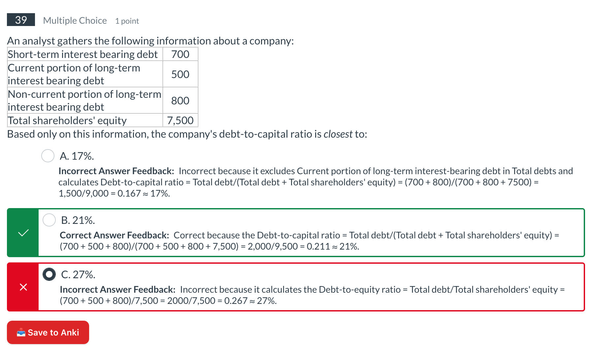
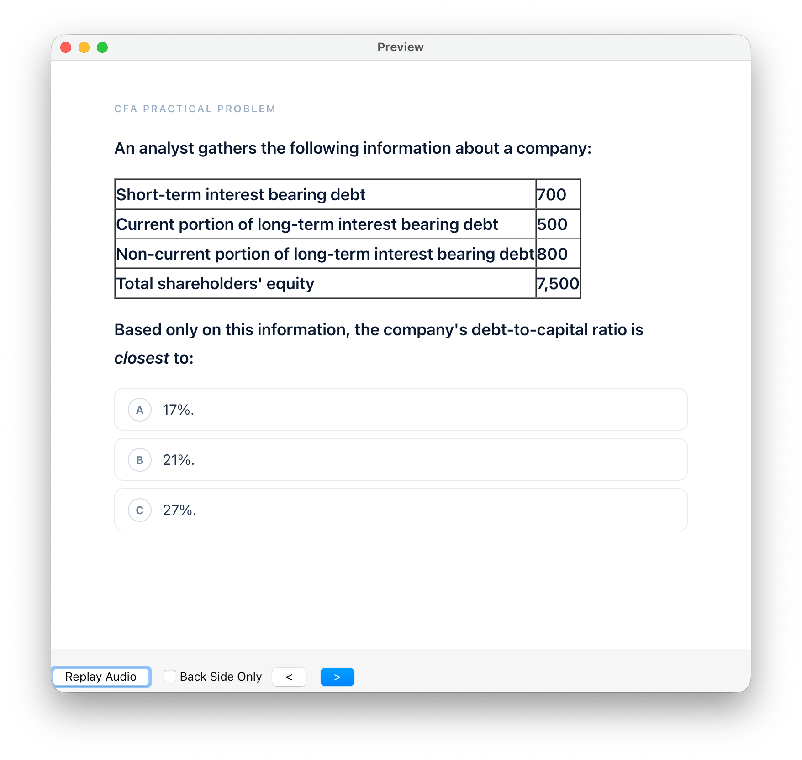
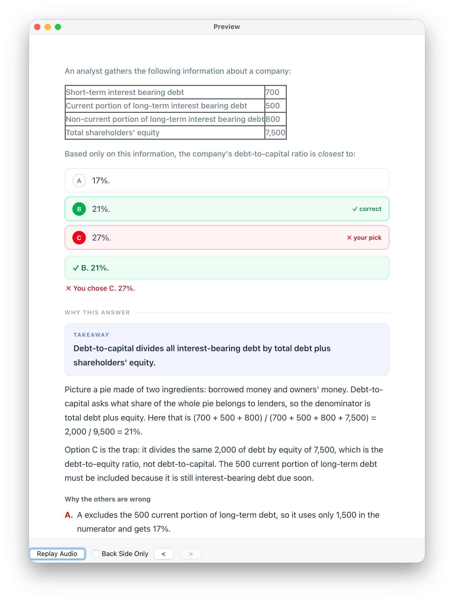

# CFA Practical Problems → Anki

A Chrome extension (Manifest V3) that saves **CFA Institute practical problems**
to Anki via [Anki-Connect](https://foosoft.net/projects/anki-connect/), with
LLM-generated **storytelling explanations** and a **CFA term glossary** on the
back of each card.

## How it works

The CFA Institute practice page — the source UI the extension operates on:



1. **Detect** — on `https://learn.cfainstitute.org/courses/*/external_tools/*`
   the content script watches the (SPA) page and finds question blocks:
   `div[data-quiz-question-id="…"]`.
2. **Button** — every question gets an injected **📥 Save to Anki** button
   (an outline button in Anki's dark gray) plus a quieter **✨ AI Explain**
   button on the right edge. The "added" status is **queried from Anki
   itself** (batched `findNotes` on the `cfa-qid-<id>` tags) — the extension
   keeps no local saved-state, so it always reflects reality (delete a card
   in Anki and the pill disappears). Added questions show **✓ Added to
   Anki** with a **↻ Re-add to Anki** button, and the card back is rendered
   below the button (fetched from Anki on page load) so you can reread the
   explanation.
3. **Extract** — on click, the question stem, options, the correct answer
   (`svg[name="IconCheck"]`) and your pick (`svg[name="IconX"]` + checked) are
   read from the DOM. Shared vignette scenarios (intro text + exhibit tables)
   preceding the question are included so each card is self-contained. The
   page's official per-option feedback (`Correct Answer Feedback:` /
   `Incorrect Answer Feedback:`) is captured as well.
4. **Generate / AI Explain** — **✨ AI Explain** sends the question (plus any
   vignette) and the page's official feedback as a reference to an
   OpenAI-compatible LLM (**Chat Completions** or **Responses** API), which
   returns a JSON study note: answer letter, a structured storytelling
   explanation (big idea, short paragraphs, wrong-option reasons, memory
   hook), and storytelling-style CFA `terms` with definitions. It previews
   the card back under the button **without touching Anki**, so you can
   review the explanation first; the generated note is cached per question.
5. **Add to Anki** — Anki-Connect creates the note in the configured deck.
   Saving **always replaces** an existing card (checked by tag
   `cfa-qid-<id>`), and the note is re-queried afterwards to verify it
   landed before the UI flips to "added". If **AI Explain** ran first, its
   note is **reused** — no second LLM request — and only the card back is
   shown under the button (the front would just repeat the question already
   on the page); direct saves show front and back. Uses the `CFA Practical
   Problem` note type whose card templates render the styled UI.

### Card layout
- **Front:** question stem + options (no answer revealed).

  

- **Back:** correct-answer verdict, options with green correct / red "you
  chose" highlights, **Official Tips** (the page's official feedback shown
  verbatim — ✓ correct / ✗ wrong options), **Why this answer** (storytelling
  explanation), **Key terms** glossary rows, and a small source footer.

  

## Setup

1. **Anki + Anki-Connect** — install the
   [AnkiConnect add-on](https://ankiweb.net/shared/info/2055492159)
   (code `2055492159`) and restart Anki.
2. **Allow the extension to reach Anki** — open the AnkiConnect config and add
   your extension id to the CORS allow-list:
   ```json
   {
     "webCorsOriginList": ["chrome-extension://<YOUR_EXTENSION_ID>"]
   }
   ```
   The id is shown at `chrome://extensions` (enable *Developer mode*) after
   loading the extension. Restart Anki after editing the config.
3. **Load the extension** — `chrome://extensions` → *Developer mode* →
   *Load unpacked* → select this folder.
4. **Configure** — open the extension's options page and set:
   - API base URL (any OpenAI-compatible endpoint; defaults to
     `https://api.openai.com/v1`), API key, model, and API style
     (`chat` = Chat Completions, `responses` = Responses API)
   - Anki-Connect URL (default `http://127.0.0.1:8765`)
   - Target deck (default `CFA::Practical Problems`, created automatically)
   - Use the **Test Anki** / **Test LLM** buttons to verify both connections.
     Test Anki also creates the deck and keeps the note type's templates/CSS
     up to date without saving a card.
5. Open a practical problem page → click **📥 Save to Anki** on any question.

## Development

- `test/sample.html` is a local fixture replicating the question HTML
  (one failed, one unanswered, one correct). To test detection against it:
  `chrome://extensions` → extension details → enable
  **Allow access to file URLs**, then open the file in a tab.
- If CFAI changes its markup, the selectors live in `src/content.js`
  (`extractOptions`, `.user_content`, `.fs-mask`, `svg[name="IconCheck"]`…).

## Troubleshooting

- **Save to Anki reports "Extension connection lost"** (or the console shows
  `Cannot read properties of undefined (reading 'sendMessage')`) — the
  extension was reloaded or updated at `chrome://extensions` while the quiz
  page was already open, which severs the injected script's Chrome API
  bindings. Simply **refresh the quiz page** to re-inject the content script.

## Notes & limitations

- The page's official per-option feedback is captured and shown **verbatim**
  in the **Official Tips** section of the card; it is also sent to the LLM as
  a reference so the generated explanation aligns with the official rationale.
- Exhibit tables and images are styled for the card (bordered ledger tables,
  images scaled to the card width); the same styles appear in the on-page
  preview. Existing note types pick the updated CSS up automatically.
- The LLM writes formulas as LaTeX math — `\( … \)` inline, `\[ … \]` on
  their own line. Anki's built-in MathJax renders them in the card, and the
  on-page preview typesets them with the page's MathJax when present (or a
  loaded copy of MathJax, CSP permitting). Math in the original page markup
  (MathML) still degrades to plain text.
- The API key is stored in `chrome.storage.local`; requests go directly from
  the extension to your chosen endpoint.
- The note type is created once, only if missing — templates you customize
  inside Anki are never overwritten.
- AnkiConnect cannot add fields to an existing note type. On installs created
  before the `OfficialTips` field existed, official tips are embedded at the
  end of the **Why this answer** section instead; add the `OfficialTips` field
  manually in Anki's note-type editor (Browse → note type → Fields) to get the
  separate **Official Tips** section.
